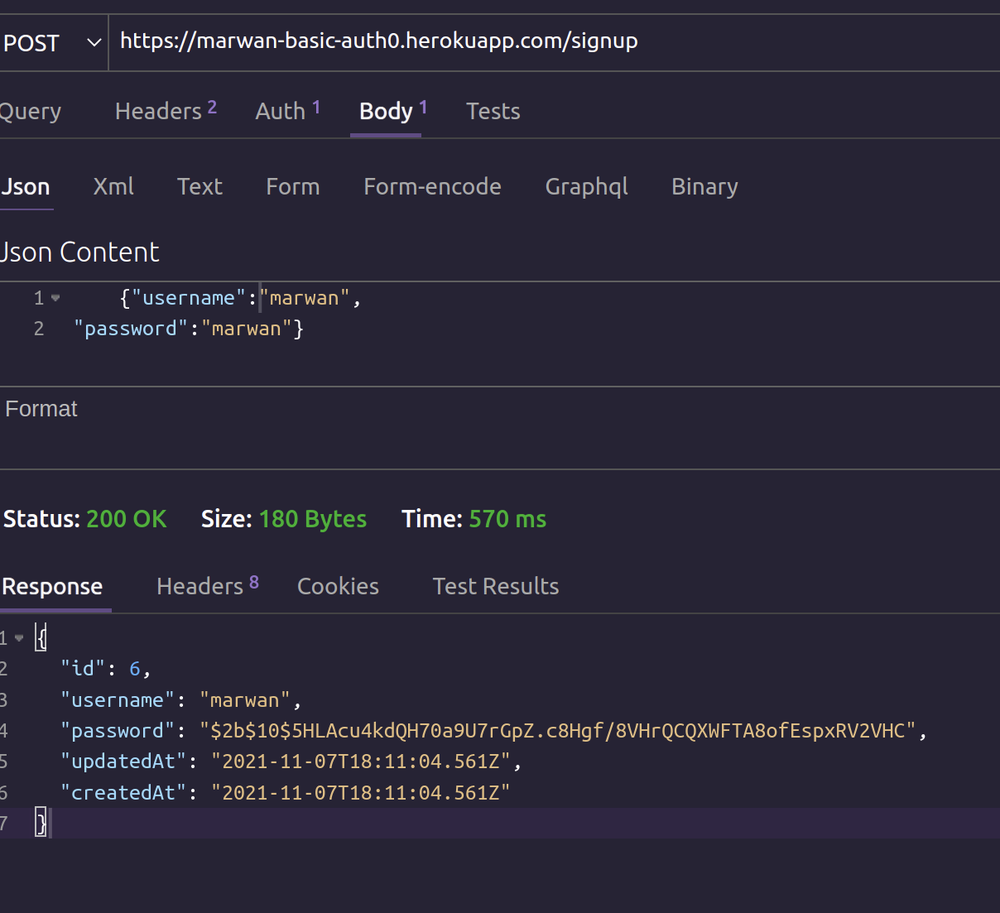
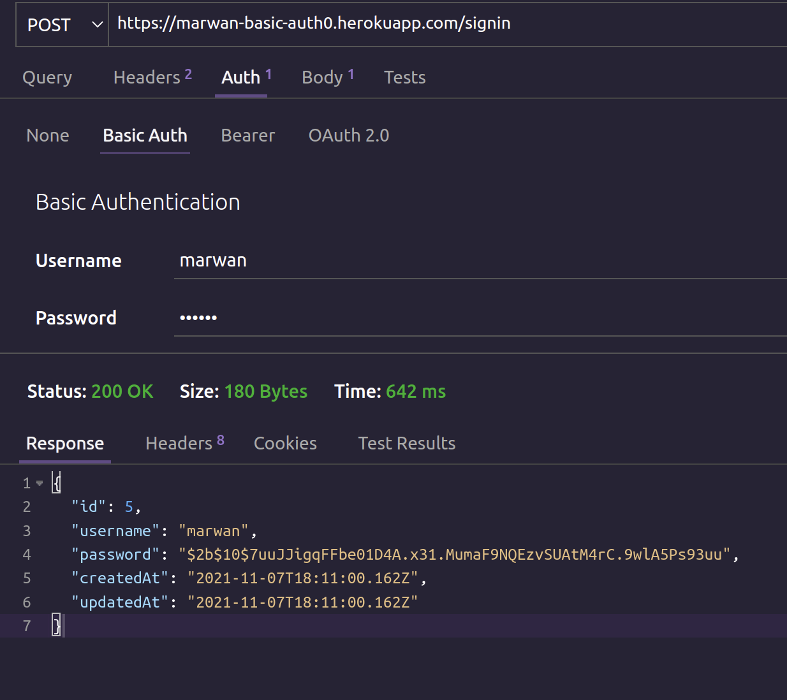
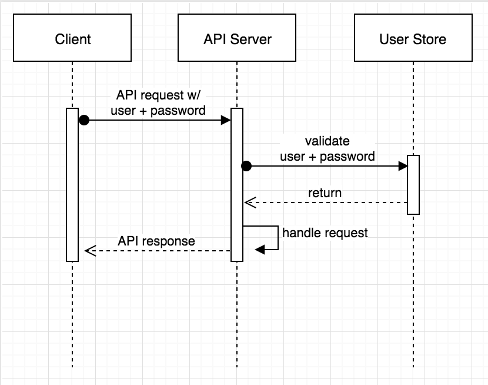

# basic-auth

in todays lab we made an basic auth server with its own midllewear
and the sign up and in ruots tested 
for testing

====================
{"username": "YOURNAME",
"password":"PASSword"}

